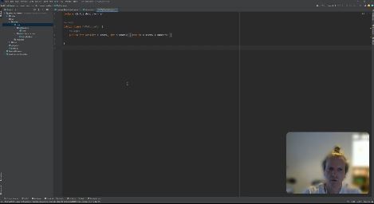

<!-- TOC -->
* [Unit Testing](#unit-testing)
  * [Glossar:](#glossar)
  * [Lernziel:](#lernziel)
  * [Einführung](#einführung)
  * [Die Rolle von Unit-Tests](#die-rolle-von-unit-tests)
  * [Was zeichnet gute Unit-Tests aus](#was-zeichnet-gute-unit-tests-aus)
  * [Einführung Unit-Testing mit JUnit 5](#einführung-unit-testing-mit-junit-5)
  * [Weiterführende Themen für JUnit](#weiterführende-themen-für-junit)
  * [Source](#source)
* [Checkpoint](#checkpoint)
<!-- TOC -->

# Unit Testing

---

## Glossar:

| Abkürzung | Erklärung                                                            |
|-----------|----------------------------------------------------------------------|
| CI/CD     | Continuous integration and continuous delivery/continuous deployment |

## Lernziel:

* Ich weiss, was Unit-Tests sind
* Ich weiss, wozu es Unit-Tests braucht
* Ich weiss, was gute Unit-Tests auszeichnet
* Ich habe erste praktische Erfahrungen mit Unit-Tests gesammelt
* Ich habe die Unit-Tests in einer CI/CD Pipeline automatisiert

--- 

## Einführung

Unit-Testing ist eine Methode innerhalb der Software Testing Disziplin, welche einzelne Teile, oder eben
sogenannte 'units' von Source Code testet. So soll abgesichert werden, dass die von den Entwicklern geschriebenen
Komponenten so arbeiten, wie vorgesehen wurde. Zur Qualitätssicherung wird eine häufige Ausführung der Tests angestrebt.
Darum macht es Sinn, dass Unit-Tests automatisiert vorliegen und die Ausführung entweder automatisch durch einen build
oder per Knopfdruck ausgeführt werden können. Normalerweise werden Unit-Tests in der gleichen Sprache wie das Testobjekt
geschrieben. Unit-Tests schreiben gehört zu den Aufgaben eines Entwicklers.

## Die Rolle von Unit-Tests

* Dienen eher dazu, das Design der Software zu steuern, als Defekte zu finden
* Sind unverzichtbar, um langfristig änderbaren Code zu behalten
* Wichtige Voraussetzung für Refactorings
* Versehentliche Änderungen werden sofort aufgedeckt
* Helfen das System zu dokumentieren, in dem Testcases verwendet werden

## Was zeichnet gute Unit-Tests aus

Gute Unit-Tests

* ... sind isoliert: Sie sind voneinander unabhängig, so dass die Reihenfolge ihrer Ausführung das Testergebnis nicht
  beeinflusst. Schlägt ein Test fehl, so führt dies nicht dazu, dass weitere Tests fehlschlagen.
* ... sichern jeweils genau eine Eigenschaft ab. Ein Problem äussert sich immer in genau einem fehlschlagenden Test.
* ... sind vollständig automatisiert
* ... sind schnell ausführbar
* ... sind wiederholbar und liefern immer das gleiche Ergebnis
* ... sind leicht verständlich und kurz.
* ... weisen eine genau so hohe Codequalität auf, wie der Produktivcode selbst (Redundanzen, Code Conventions,...).
* ... testen relevanten Code (und z.B. keine Getter/Setter).
* ... werden idealerweise vor dem zu testenden Code geschrieben (siehe mehr dazu im Thema [Test Driven Development](../test-driven-development))

Weiterführende Links:

* [F.I.R.S.T Principles of Unit Testing](https://github.com/tekguard/Principles-of-Unit-Testing)

## Einführung Unit-Testing mit JUnit 5

## Weiterführende Themen für JUnit

Bitte lesen Sie zusätzlich noch folgende Artikel, für einen groben Einblick der JUnit Features: 
**Achtung die PDF's können z.T. nicht in Gitlab dargestellt werden und müssen daher einzeln gedownloadet werden**
* Mehr dazu im [PDF](junit-1.pdf)
* Mehr dazu im [PDF](junit-2.pdf)
* Mehr dazu im [PDF](junit-3.pdf)

Optional und eher als Referenz:
* https://www.vogella.com/tutorials/JUnit/article.html

---

## Source

* https://en.wikipedia.org/wiki/Unit_testing
* https://www.it-agile.de/agiles-wissen/agile-entwicklung/unit-tests/#:~:text=Was%20ist%20ein%20Unit%2DTest,h%C3%A4ufige%20Ausf%C3%BChrung%20der%20Komponententests%20angestrebt.

# Checkpoint

* Mir ist bewusst, auf welchem Test Level sich Unit Tests befinden
* Ich weiss, wieso Unit Tests unverzichtbar sind
* Ich bin mir bewusst, was gute Unit Tests auszeichnet
* Ich weiss wie man Unit Tests mit JUnit erstellt und ausführt
* Mir ist bewusst, wie ich die Test Coverage meiner Implementation sehen kann