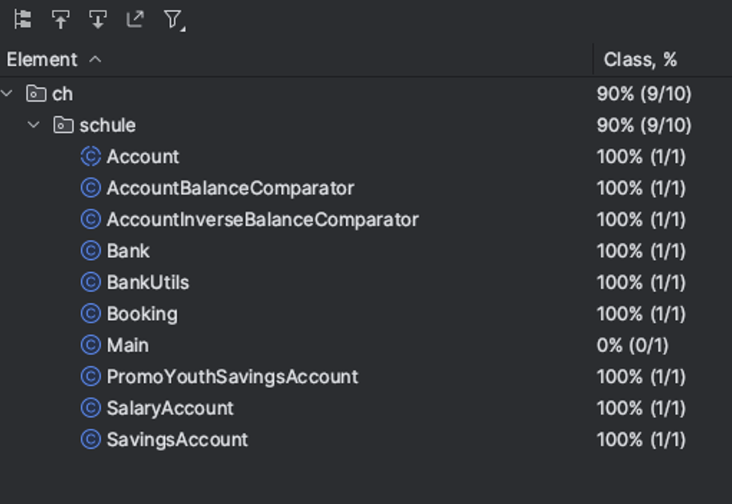

# Aufgaben

* Lösen Sie die Aufgaben zu zweit in der Gruppe
* Stellen Sie sicher, dass Ihre Lösungen in Ihrem Repository abgelegt sind

## Aufgabe 1 - Simpler Rechner

* Machen Sie sich mit JUnit Tests vertraut, indem Sie für eine *Calculator* Klasse entsprechende Unit-Tests schreiben.
* Ihre *Calculator* Klasse hat z.Bsp. folgende Methode:

```java
public double add(double summand1, double summand2) {
  return summand1 + summand2;
}
```

* Erstellen Sie die Klasse mit allen Methoden in einem main package
* Nun erstellen Sie in einem test package die entsprechende Unit Test Klasse. Verwenden Sie die korrekten Annotations aus JUnit 5.
* Testen Sie die verschiedene Fälle und alle Methoden +,-,*,/ und führen Sie dann die Tests durch:
    1)	Mit Entwicklungsumgebung ausführen
    2)	Mit Maven auf der Kommandozeile ausführen

---

## Aufgabe 2 - JUnit Zusammenfassung

* Fassen Sie in einem Markdown-Dokument die gängigsten JUnit Features zusammen
* Erklären Sie kurze Anwendungsfälle / Beispiele für die jeweiligen Features
* Verlinken Sie eine Referenz Seite, welche Ihnen zusagt


---

## Aufgabe 3 - Banken Simulation

* Setzen Sie die [Banken Simulation](02_bank-vorgabe.zip) dementsprechend bei Ihnen lokal auf (Java / Maven Projekt)
* Studieren Sie die Software anhand des Codes und dem Klassendiagramm
* Dokumentieren Sie in Stichworten in einem Markdown-Dokument, wie die Software funktioniert und wie die Zusammenhänge sind.


---

## Aufgabe 4 - Unit-Tests implementieren

* Implementieren Sie nun die Tests für die Banken Simulation
* Schauen Sie, dass die Code Coverage dementsprechend ist:


