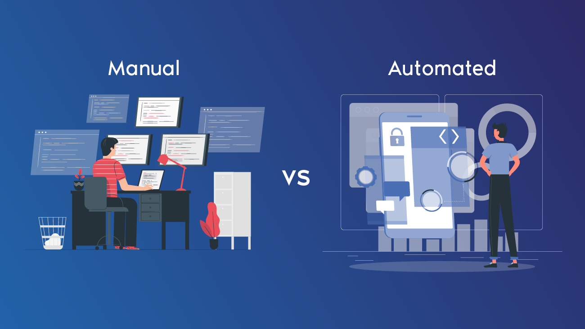
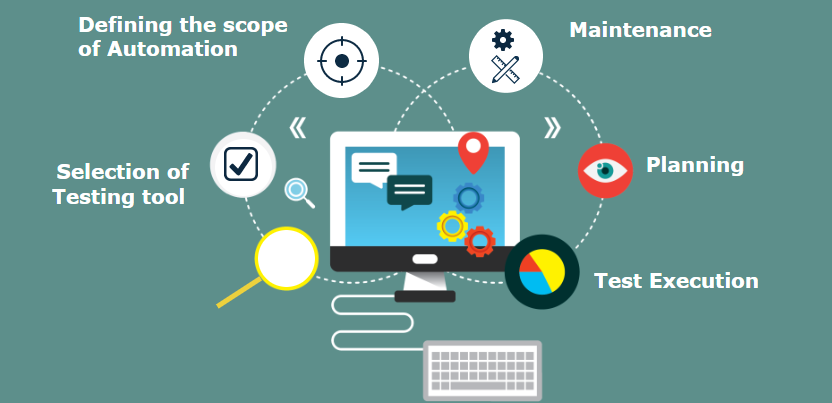

<!-- TOC -->
* [Automation Testing](#automation-testing)
  * [Glossar:](#glossar)
  * [Lernziel:](#lernziel)
  * [Einführung](#einführung)
    * [Manual Testing](#manual-testing)
    * [Automation Testing](#automation-testing-1)
    * [Vorteile und Unterschiede](#vorteile-und-unterschiede)
    * [Wichtige Punkte für Automation Testing](#wichtige-punkte-für-automation-testing)
    * [Schritte um Automatisiertes Testing aufzusetzen](#schritte-um-automatisiertes-testing-aufzusetzen)
    * [Typen](#typen)
  * [Tools](#tools)
    * [Tools für Tester](#tools-für-tester)
    * [Tools auch für Entwickler](#tools-auch-für-entwickler)
  * [Source](#source)
* [Checkpoint](#checkpoint)
<!-- TOC -->

# Automation Testing

---

## Glossar:

| Abkürzung | Erklärung            |
|-----------|----------------------|
| ROI       | Return of investment |

## Lernziel:

* Ich weiss was 'Manual Testing' und 'Automation Testing' ist
* Ich kenne die Unterschiede zwischen beiden Prozessen

--- 

## Einführung

Hier erklären wir die Unterschiede zwischen manuellem und automatisierten Testen. Wichtig anzumerken an dieser Stelle,
dass wir uns hier bei vielen Stellen aus der Welt des Entwicklers heraus bewegen in die Richtung eines Test Managers.
Trotzdem ist es wichtig für Sie als Entwickler die Zusammenhänge und Wörter zu verstehen, da Sie sehr eng mit Testern
zusammen arbeiten werden.

### Manual Testing

'Manual Testing' ist ein Software Testing Prozess in welchem die Test Cases manuell von einem Menschen ausgeführt
werden.
Alle Tests werden aus Sicht des End-Benutzers manuell ausgeführt. Es versichert, dass die Applikation so sich verhält 
(oder eben nicht) wie in den Requirements aufgeschrieben wurde. Die Test Case Reports werden ebenfalls manuell erstellt.
Manuelles Testing kommt oft zum Zuge, wenn der Aufwand von Automation Testing zu gross ist.

### Automation Testing

'Automation Testing' oder 'Test Automation' ist eine Software Testing Technik, welche Software Tools benutzt um
automatisiert Test Case Suiten (ganze Reihen von Tests) auszuführen.

### Vorteile und Unterschiede

Beide Ansätze haben ihre Vor- und Nachteile. Ein Hauptgrund für manuelles Testing mag sein, dass der initiale Aufwand
für Automation Testing schlichtweg zu gross ist oder das Wissen der Mitarbeiten fehlt. Oft sieht man natürlich auch,
dass eine hybrid Lösung benutzt wird, wo beide Arten zum Zuge kommen 
Hier ein Vergleich von beiden:

| Automation Testing                                                                                             | Manual Testing                                                                                                              |
|----------------------------------------------------------------------------------------------------------------|-----------------------------------------------------------------------------------------------------------------------------|
| Zuverlässig, jeder Test ist programmiert / scripted                                                            | Unzuverlässig, menschliche Fehler passieren schnell                                                                         |
| Riesiger Initial Aufwand, billiger auf lange Zeit                                                              | Initialer Aufwand ist kleiner. [ROI](https://en.wikipedia.org/wiki/Return_on_investment) ist kleiner auf lange Zeit gesehen |
| Ist eine sehr zeitsparende Option für Regression Testing (Tests welche mehrere Male ausgeführt werden sollen). | Eher eine Option wenn die gleichen Tests nicht laufend wieder ausgeführt werden müssen.                                     |
| Ausführung durch einen einzigen Knopfdruck (oder automatisiert durch einen Trigger)                            | Ausführung braucht sehr viel Ressourcen (Mitarbeiter multipliziert mit den Anzahl Stunden)                                  |
| Exploratives Testen **nicht** möglich                                                                          | Exploratives Testen möglich                                                                                                 |
| Performanz Testing ist möglich                                                                                 | Performanz Testing ist **nicht** möglich                                                                                    |
| Tests können parallelisiert ausgeführt werden                                                                  | Braucht mehr Ressourcen, um parallel zu Testen                                                                              |
| Braucht Programmier/Scripting Skills, um Tests zu erstellen                                                    | Brauch sehr wenig Wissen, um einen Test auszuführen                                                                         |
| Professionelle Testing Tools können sehr schnell teuer werden                                                  | -                                                                                                                           |

### Wichtige Punkte für Automation Testing

* Test Automation ist der beste Weg, um folgende Punkte in Software Testing zu verbessern:
    * Effizienz
    * [Test Coverage](https://en.wikipedia.org/wiki/Code_coverage)
    * Ausführungszeit
* Das Auswählen eines Test Tools ist sehr technologie Abhängig
* Wichtig für eine erfolgreiche Test Automation sind vorallem:
    * Das Auswählen des richtigen Tools
    * Definieren und einhalten eines Testing Prozesses
    * Das Testing Team
    * Manuelles und Automatisches Testen sind aneinander abgestimmt

### Schritte um automatisiertes Testing aufzusetzen
* Geeignetes Test Tool auswählen
* Den Scope (Anwendungsbereich) der Automation definieren
* Test Cases 
  * Planen
  * Definieren
  * Implementieren
* Tests ausführen
* Tests warten (Maintenance)

### Typen

Es ist extrem wichtig, dass man weiss, welche Typen von Tests existieren, bevor man eine Test Automation in einem Betrieb
einführt. So kann man besser abgrenzen und sich darauf festlegen, was man wirklich braucht. Dies gibt Aufschluss darüber,
wie umfassend die Test Automatisierung sein muss, um die Anforderungen korrekt abzudecken. Hier die wichtigsten Typen als
Übersicht:

* Functional Testing
* Non-functional testing
* Smoke testing
* Regression testing
* Keyword-driven testing und Data-driven testing

**Functional Testing** konzentriert sich in erster Linie darauf, ob die Software bei einem bestimmten Input den
entsprechenden Output liefert. Ein funktionales Beispiel wäre: Kann sich der Benutzer einer Webseite erfolgreich
einloggen.

**Non-functional testing** bezieht sich auf Aspekte der Software, die nicht unbedingt mit einer bestimmten Funktion oder
Benutzeraktion zusammenhängen, wie z. B. Skalierbarkeit, Verhalten unter bestimmten Einschränkungen (Stress Tests) oder
der Sicherheit.

**Smoke testing** oder auch oft Sanity Testing genannt, besteht aus minimalen Tests, die Software zu betreiben, um
festzustellen, ob es grundlegende Probleme gibt, die verhindern, dass sie überhaupt funktioniert. Es wird hier also nur
das absolut essenziellste getestet.

**Regression testing** konzentrieren sich auf das Auffinden von Fehlern, nachdem eine grössere Codeänderung stattgefunden
hat. Insbesondere sollen Software-Regressionen aufgedeckt werden, d. h. verschlechterte oder verlorene Funktionen,
einschliesslich alter Fehler, die wieder aufgetreten sind. Solche Regressionen treten immer dann auf, wenn
Softwarefunktionen, die zuvor korrekt funktionierten, nicht mehr wie vorgesehen funktionieren. Typischerweise treten
Regressionen als unbeabsichtigte Folge von Programmänderungen auf, wenn der neu entwickelte Teil der Software mit dem
bereits vorhandenen Code kollidiert. Regressionstests sind in der Regel der grösste Testaufwand in der kommerziellen
Softwareentwicklung, da zahlreiche Details in früheren Softwarefunktionen überprüft werden.

--- 
## Tools

### Tools für Tester

Hier einige der bekannteren Tools als Überblick. Hier anzumerken ist, dass es sich meistens um Tools handelt welche eher
ein Tester benutzt:

* [Selenium](https://www.selenium.dev/) - deckt auch UI Testing und Backend Testing ab
* [HP UFT](https://en.wikipedia.org/wiki/Micro_Focus_Unified_Functional_Testing)
* [Zephyr](https://smartbear.com/test-management/zephyr/)
* [Eggplant](https://www.keysight.com/us/en/cmp/2023/eggplant-test-automation.html)
* [Testrail](https://www.testrail.com/)
* [TestComplete](https://en.wikipedia.org/wiki/TestComplete)

### Tools auch für Entwickler

Hier gute Tools um Schnittstellen (APIs) zu testen:

* [Postman](https://www.postman.com/)
* [Swagger](https://swagger.io/)
* [SoapUI](https://en.wikipedia.org/wiki/SoapUI)

Backend Tools / Frameworks:
* [JMeter](https://jmeter.apache.org/)
* [JUnit](https://junit.org/)
* [TestNg](https://testng.org/)
* [Mockito](https://site.mockito.org/)
* [Cucumber](https://en.wikipedia.org/wiki/Cucumber_(software))

Für UI Tests oder je nachdem End-to-End Tests können folgendes Tools zum Zuge kommen:
* [Cypress](https://www.cypress.io/)
* [Protractor](https://www.protractortest.org/)
* [Jasmine](https://jasmine.github.io/)
* [Jest](https://en.wikipedia.org/wiki/Jest_(framework))
* [LambaTest](https://www.lambdatest.com/)
* [Playwright](https://playwright.dev/)
* [Puppeteer](https://pptr.dev/)

---

## Source

* https://en.wikipedia.org/wiki/Software_testing#Testing_types,_techniques_and_tactics
* https://www.sitesbay.com/software-testing/st-what-is-automation-testing
* https://prolifics.com/us/resource-center/specialty-guides/test-automation-guide/types-of-automated-testing
* https://www.lambdatest.com/software-testing-questions/what-is-difference-between-keyword-driven-and-data-driven-testing

--- 

# Checkpoint

* Ich kenne die Vor- und Nachteile von 'Manual Testing' und 'Automation Testing'
* Ich kann mir vorstellen, wo welche Variante eher angewendet wird
* Ich kenne die Schritte, um ein Testing aufzusetzen
* Ich kenne verschiedene Typen von Tests
* Ich kenne verschiedene Tools und wer Sie anwenden könnte