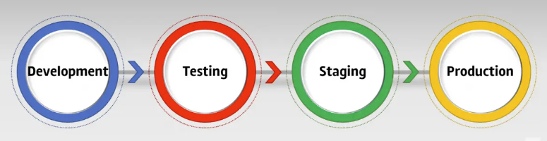

<!-- TOC -->

* [Testumgebungen](#testumgebungen)
    * [Glossar:](#glossar)
    * [Lernziel:](#lernziel)
    * [Einführung](#einführung)
        * [Typen von Environments](#typen-von-environments)
            * [Development Environment](#development-environment)
            * [Testing Environment](#testing-environment)
            * [Staging Environment](#staging-environment)
            * [Production Environment](#production-environment)
    * [Source](#source)
* [Checkpoint](#checkpoint)

<!-- TOC -->

# Deployment Environment

---

## Glossar:

| Abkürzung | Erklärung                        |
|-----------|----------------------------------|
| SDLC      | System development life cycle    |
| SDE       | Software development environment |

## Lernziel:

* Ich kenne die verschiedenen Typen an deployment environments
* Ich kenne die Anwendungszwecke der einzelnen Typen

--- 

## Einführung

Software testing is ein kritischer Teil
ihres [System Development Life Cycle](https://en.wikipedia.org/wiki/Systems_development_life_cycle). Ob es sich hier
um neue Software / Applikationen, Patches oder Updates handelt, beim Testing ist das Ziel immer, dass es versichert,
dass der Code das tut, was er soll, bevor er produktiv released wird. 

Bei der Softwarebereitstellung ist ein Environment ein Computersystem oder eine Reihe von Systemen, in denen
ein Computerprogramm oder eine Softwarekomponente bereitgestellt und ausgeführt wird. In einfachen Fällen, z. B. bei der
Entwicklung und sofortigen Ausführung eines Programms auf demselben Rechner, kann es sich um eine einzige Umgebung
handeln, aber im industriellen Einsatz sind die Entwicklungsumgebung (in der die Änderungen ursprünglich vorgenommen
werden) und die Produktionsumgebung (die von den Endbenutzern verwendet wird) voneinander getrennt, oft mit mehreren
Stufen dazwischen. Dieser strukturierte Prozess der Versionsverwaltung ermöglicht eine schrittweise Einführung
(Rollout), Tests und ein Rollback im Falle von Problemen.

## Typen von Environments

Folgendes Environments findet man in der Regel:

* Development Environment
* Testing Environment
* Staging Environment
* Production Environment

### Development Environment

Normalerweise handelt es sich dabei um den Desktop/Workstation eines Entwicklers.
Hier werden in der Regel, die feature branches in den main/master branch gemergt und getestet. In der Regel testen hier
die Entwickler selber oder andere interne Mitglieder.

<!-- TODO: überarbeiten... ist nicht klar, ob es sich bei der Beschreibung immer noch um die lokale Entwicklungsumgebung handelt oder um ein entferntes DEV-System -->
Die Entwicklungsumgebung (dev) ist die Umgebung, in der Änderungen an der Software entwickelt werden, meist die
Workstation eines einzelnen Entwicklers. Diese unterscheidet sich von der letztendlichen Zielumgebung in verschiedener
Hinsicht - das Ziel muss kein Desktop-Computer sein (es kann ein Smartphone, ein eingebettetes System, eine
Headless-Maschine in einem Rechenzentrum usw. sein), und selbst wenn die Umgebung des Entwicklers ansonsten ähnlich ist,
enthält sie Entwicklungswerkzeuge wie einen Compiler, eine integrierte Entwicklungsumgebung (IDE - integrated development environment), andere oder zusätzliche
Versionen von Bibliotheken und Support-Software usw., die in der Umgebung des Benutzers nicht vorhanden sind.

### Testing Environment

Der Zweck der Testumgebung besteht darin, menschlichen Testern die Möglichkeit zu geben, neuen und geänderten Code
entweder durch automatisierte Prüfungen oder durch nicht automatisierte Techniken zu testen. Nachdem der Entwickler den
neuen Code und die Konfigurationen durch Unit-Tests in der Entwicklungsumgebung akzeptiert hat, werden die Elemente in
eine oder mehrere Testumgebungen verschoben. Bei Fehlschlagen der Tests kann die Testumgebung den fehlerhaften Code
von den Testplattformen entfernen, den verantwortlichen Entwickler kontaktieren und detaillierte Test- und
Ergebnisprotokolle bereitstellen. Wenn alle Tests erfolgreich sind, kann die Testumgebung oder ein
Continuous-Integration-Framework, das die Tests kontrolliert, den Code automatisch in die nächste
Bereitstellungsumgebung übertragen.

Je nach Ausgereiftheit der Testumgebung können die Tests seriell (nacheinander) oder parallel (einige oder alle auf
einmal) erfolgen. Ein wichtiges Ziel agiler und anderer hochproduktiver Softwareentwicklungsverfahren ist die Verkürzung
der Zeit vom Softwareentwurf oder der Spezifikation bis zur Auslieferung in der Produktion. Hochautomatisierte und
parallelisierte Testumgebungen leisten einen wichtigen Beitrag zur schnellen Softwareentwicklung.

### Staging Environment

Eine Stage-, Staging- oder Pre-Production-Umgebung ist eine Testumgebung, die einer Produktionsumgebung möglichst genau
entspricht und mit anderen Produktionsdiensten und -daten (z. B. Datenbanken) verbunden werden kann. So werden
beispielsweise Server nicht lokal, sondern auf entfernten Rechnern ausgeführt (wie auf der Workstation eines Entwicklers
während der Entwicklung oder auf einem einzelnen Testrechner während des Tests), wodurch die Auswirkungen der Vernetzung
auf das System getestet werden.

Der Hauptzweck einer Staging-Umgebung besteht darin, alle Installations-/Konfigurations-/Migrations-Skripte und
-Verfahren zu testen, bevor sie in einer Produktionsumgebung angewendet werden. Dadurch wird sichergestellt, dass alle
grösseren und kleineren Upgrades in einer Produktionsumgebung zuverlässig, fehlerfrei und in kürzester Zeit durchgeführt
werden.

Ein weiterer wichtiger Verwendungszweck von Staging sind Leistungstests (Engl. performance testing), insbesondere
Lasttests (Engl. load testing), da diese häufig von der Umgebung abhängig sind.

Einige Unternehmen nutzen Staging auch, um ausgewählten Kunden eine Vorschau auf neue Funktionen zu geben oder um
Integrationen mit Live-Versionen externer Abhängigkeiten zu validieren.

### Production Environment

Die Produktionsumgebung wird auch als Live-Umgebung bezeichnet, insbesondere bei Servern, da dies die Umgebung ist, mit
der die Benutzer direkt interagieren.

Die Bereitstellung für die Produktion ist der heikelste Schritt; sie kann durch direkte Bereitstellung von neuem Code
(Überschreiben von altem Code, sodass jeweils nur eine Kopie vorhanden ist) oder durch eine Konfigurationsänderung
erfolgen.

**Offtopic**: Hier ein [Beispiel](https://www.youtube.com/watch?v=3WRVgC8SiGc&t=5s) von der Firma Netflix, wie sie in
einer
produktiven Umgebung Testen. Chaos Engineering hat sich mittlerweile
auch [weiterentwickelt](https://www.youtube.com/watch?v=Xbn65E-BQhA).

## Kurze Klärung der Begriffe: Patch - Update - Upgrade

Als **Patch** bezeichnet man Softwareupdates, welche ein oder mehrere Probleme einer Applikation beheben. Sie werden
meistens sehr zeitnah erstellt. Patches betreffen meistens nur einen Teil eines Systems, darum geschieht das Einspielen
eines Patches meistens im laufenden Betrieb.

Ein **Update** bringt die Software „up to date“, also auf den neuesten Stand. Ein Update ist demnach nichts anderes als
eine
Aktualisierung, die Fehler in der Software beheben oder die Performance verbessern soll. Oft werden auch kleine
Erweiterungen über ein Update zur Verfügung gestellt, etwa Unterstützung für neue Hardware oder eine neue Funktion, die
die Arbeit mit der Software erleichtern soll.

Das entscheidende Merkmal eines Updates ist aber, dass es den Funktionsumfang oder die Funktionsweise der Software nicht
substantiell verändert.

Beim **Upgrade** lässt sich die Bedeutung ebenfalls am Wort selbst ablesen. Durch das Upgrade rutscht das Produkt nämlich in
einen neuen „Grade“, also in eine neue (Produkt-)Klasse. Die Software wird durch ein Upgrade auf verschiedenen Ebenen
erweitert, erhält teilweise ganz neue Funktionen und gelegentlich sogar eine völlig neue Struktur.

## Setup Deployment Environments
Manchmal bietet es sich an, das Setup der Umgebungen zu automatisieren. Wird mit Containern gearbeitet, bietet sich der Einsatz von Docker Compose oder Kubernetes an. Wenn mit VMs gearbeitet wird, dann sind Vagrant und Terraform zwei mögliche Lösungen, VM's automatisiert aufzusetzen. Für Produktivumgebungen wird eher Terraform verwendet, für das Setup der lokalen Entwicklungsumgebung wird eher Vagrant eingesetzt. Beides sind Produkte von der HashiCorp die kostenlos zur Verfügung stehen. Ein Vergleich der beiden Lösungen und was wann eingesetzt werden sollte, ist unter https://developer.hashicorp.com/vagrant/intro/vs/terraform zu finden.

In der [Übungsaufgabe](./UEBUNGEN.md) haben Sie die Möglichkeit, eine der vorgestellten Softwarelösungen auszuprobieren.

---

## Source

* https://en.wikipedia.org/wiki/Deployment_environment
* https://www.unitrends.com/blog/development-test-environments

# Checkpoint

* Ich kenne die verschiedenen Deployment Environments
* Ich kenne die Reihenfolge der Environments, welche eine Software durchläuft, bevor sie released wird
* Ich kenne die Aufgaben der einzelnen Environments
* Ich kenne den Unterschied zwischen einem Patch, Update und Upgrade
