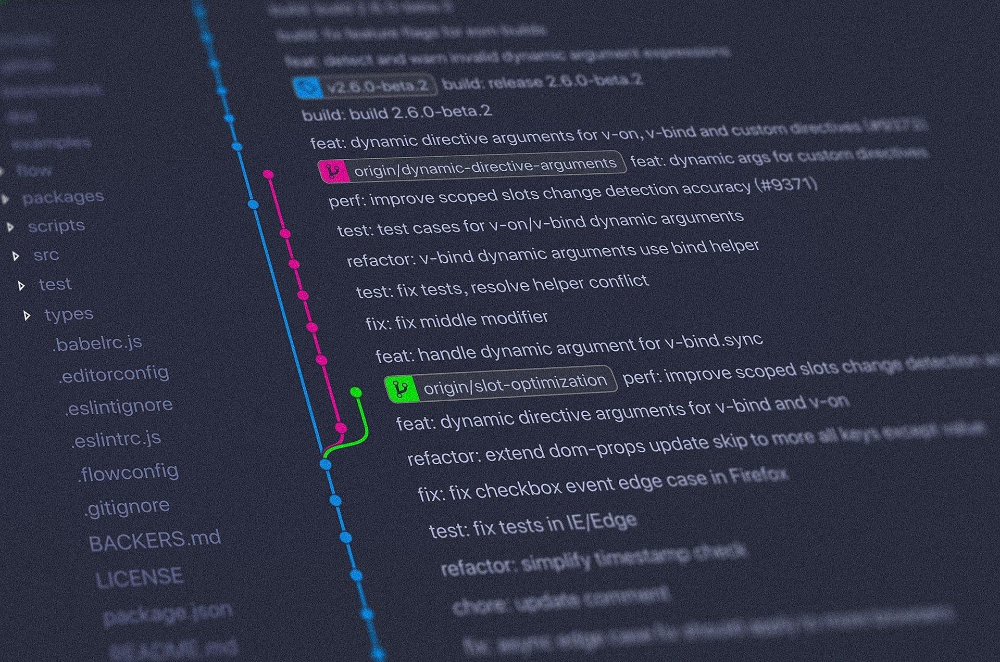
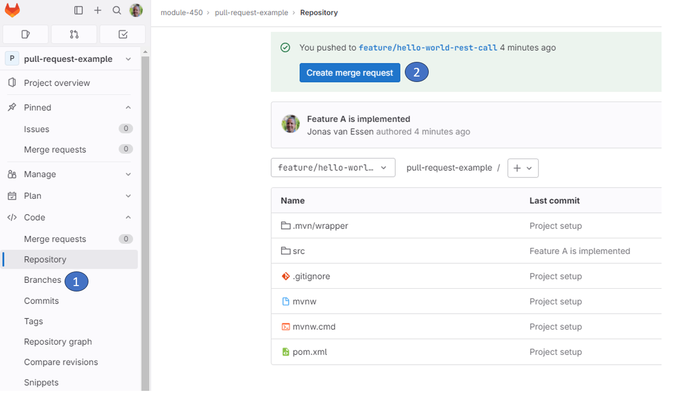
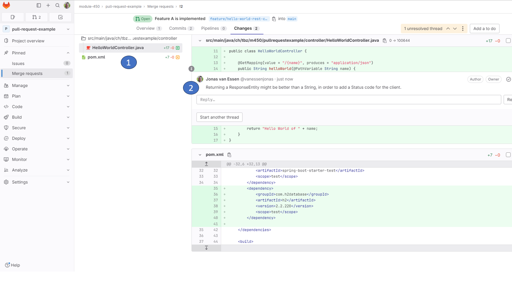
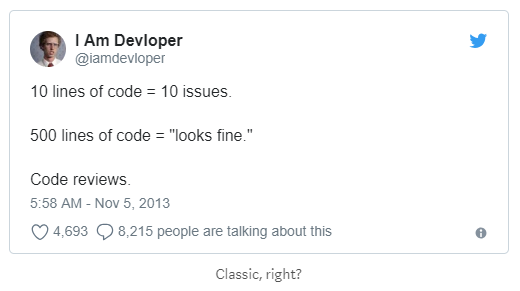

<!-- TOC -->
* [Code-Review](#code-review)
  * [Glossar:](#glossar)
  * [Lernziel:](#lernziel)
  * [Einführung](#einführung)
  * [Konvention](#konvention)
  * [Beispiel Ablauf per Gitlab](#beispiel-ablauf-per-gitlab)
    * [Umsetzung](#umsetzung)
  * [Aufgaben eines Prüfers](#aufgaben-eines-prüfers)
    * [Qualität des Codes (ein paar Beispiele)](#qualität-des-codes-ein-paar-beispiele)
      * [Resourcen](#resourcen)
    * [Soziale Aspekt eines Prüfers](#soziale-aspekt-eines-prüfers)
  * [Abschluss und Merge Varianten](#abschluss-und-merge-varianten)
* [Checkpoint](#checkpoint)
<!-- TOC -->

# Code-Review

---


## Glossar:

| Abkürzung | Erklärung    |
|-----------|--------------|
| PR        | Pull Request |

## Lernziel:

* Ich weiss was ein Code Review ist
* Ich kenne die gängigsten Funktionen eines Pull Requests
* Ich weiss in welchem Fall man einen Pull Request erstellt

--- 

## Einführung

Grundsätzlich ist ein Code Review, die Möglichkeit vom vier Augen Prinzip bezüglich jeder Code-Zeile, welche man
implementiert. Aus Code Qualitätsgründen, macht es Sinn, dass bei jedem Feature welches ein Entwickler implementiert,
mindestens eine zweite Person die Implementation anschaut. Diese Person überprüft, stellt mögliches infrage und korrigiert allenfalls.
Am Schluss gibt er seinen Segen, dass er hinter der Implementation stehen kann.

**Hinweis zu KI:** Das Review bleibt in diesem Modul Aufgabe Ihrer Teammitglieder. KI darf höchstens für einzelne
Detailfragen konsultiert werden (siehe [ki-nutzungsrahmen](../ki-nutzungsrahmen)), nicht als Ersatz für das
Vier-Augen-Prinzip.

## Konvention

Um eine Code-Review durchzuführen, spricht man meistens von einem Pull Request. Genau wie das Forken sind Pull Requests
eine Konvention, die von Git-Hosting-Diensten bereitgestellt wird und nicht ein eigenes Feature von Git ist. Obwohl es
den Befehl "git request-pull" gibt, handelt es sich dabei um etwas anderes. GitHub und Bitbucket bieten eine
Pull-Request-Funktion an, während GitLab eine ähnliche Funktion als "Merge Requests" bezeichnet.

Ein Pull Request ist eine Möglichkeit, um darum zu bitten, dass die Änderungen in einem Branch (oder einem beliebigen
Commit) in einen anderen integriert werden. Die Namen stammen daher, dass wir bei einem Pull Request jemanden bitten,
von einem bestimmten Branch in einen anderen zu ziehen und die Branches zu verschmelzen. Alle Änderungen werden
visuell auf den jeweiligen Git-Hosting-Diensten dargestellt (welche Dateien sich geändert haben, und um welchen Code
Zeile es sich handelt).

Zusätzlich zu dem oben Genannten bieten die Dienste unter dem Namen "Pull Request" verschiedene Funktionen an. Hier
sind einige Beispiele:

* Der Ersteller eines Pull Requests kann oft um eine Code-Überprüfung durch andere Entwickler (oder Gruppen von
  Entwickler) bitten.
* Die Benutzeroberfläche zur Verwaltung eines Pull Requests ermöglicht oft allgemeine Diskussionen über den Pull Request.
* Der Autor des Pull Requests oder jemand anders kann weitere Commits in den zu mergenden Branch pushen und den Pull
  Request aktualisieren.

## Beispiel Ablauf per Gitlab

1. Ein Entwickler arbeitet an einem neuen Feature, wo er die Funktionalität A einbaut.
2. In diesem Feature arbeitet er in einem dedizierten Feature Branch.
3. Sobald das Feature fertig implementiert ist, eröffnet er dafür eine Pull Request an sein Team.
4. Danach kann das Team den Code reviewen und kontrollieren
5. Der Entwickler diskutiert über die Kommentarfunktion mit den Reviewern und baut allenfalls Feedback wieder ein
6. Sobald alle zufrieden sind, wird der PR appoved und der Code wird z.B. in einen main oder master branch merged.

### Umsetzung

* Feature branch erstellen

```
git checkout -b feature
```

* Feature wird nun durch den Entwickler in der IDE implementiert
* Alle Änderungen werden einzeln oder aufs mal per Commit dem Branch hinzugefügt

```
git add .
git commit -m "Feature A is implemented"
```

* Mit dem Push kriegen wir direkt einen Link, um einen Merge (PR) Request zu erstellen

```
  C:\workspace\pull-request-example>    git push --set-upstream origin feature/hello-world-rest-call
  Enumerating objects: 19, done.
  Counting objects: 100% (19/19), done.
  Delta compression using up to 20 threads
  Compressing objects: 100% (7/7), done.
  Writing objects: 100% (11/11), 1018 bytes | 1018.00 KiB/s, done.
  Total 11 (delta 1), reused 0 (delta 0), pack-reused 0
  remote:
  remote: To create a merge request for feature/hello-world-rest-call, visit:
  remote:   https://gitlab.com/module-450/pull-request-example/-/merge_requests/new?merge_request%5Bsource_branch%5D=feature%2Fhello-world-rest-call
  remote:
  To https://gitlab.com/module-450/pull-request-example.git
* [new branch]      feature/hello-world-rest-call -> feature/hello-world-rest-call
  branch 'feature/hello-world-rest-call' set up to track 'origin/feature/hello-world-rest-call'.
```

* Um einen PR zu starten, benutzt man entweder den Link direkt aus dem Git log
* Oder man geht über die Gitlab Seite -> Repository -> Branches -> Create merge request

  

* Nun kann man den Titel bearbeiten, falls der Branch Name nicht für sich spricht
* In der Description kann man nun sämtliche Code Changes aufführen
* Wählen Sie noch die Reviewer aus
* Erstellen Sie den PR mit Create merge request
* Nun hab ich die Möglichkeit den PR zu reviewen, 1) zwischen den geänderten Files zu wechseln und 2) Kommentare zu
  machen

  

## Aufgaben eines Prüfers

Die Aufgaben eines Prüfers beinhalten mehr als nur 'kurz' mal einen Blick über die Changes zu machen. Guten PR's zu
reviewen muss geübt werden. Die Programmiererin muss sich regelrecht a) mit der Funktionalität des Features vertraut
machen, sowie b) sich über die Qualität der Implementierung Gedanken machen.

Kleine Pull Requests geben in der Regel viel Kommentare, wobei bei grösseren Pull Requests die Kommentare eher
bescheiden sind. Das liegt daran, dass grössere PRs einfach viel Aufwand zum reviewen benötigen. Ein grosser PR kann
schnell mal ein, zwei Tage zum reviewen benötigen.



Daher macht es Sinn, in der Regel Pull Requests eher kleinzuhalten. Jetzt, was heisst klein?
Eine [SmartBear Analyse von
einem Cisco Systems Team](https://smartbear.com/learn/code-review/best-practices-for-peer-code-review/), hat gezeigt,
dass eine Code-Review mit 200-400 Linien von Änderungen, die besten Resultate erzielte. Dies sollte für den Reviewer
etwa 60-90 Minuten in Anspruch nehmen.<br/>
Falls Sie nun sehen, dass ihr PR des Features wesentlich mehr Linien benötigt, besprechen Sie im Team, wie Sie ihr
Feature in kleinere Features aufteilen könnten. Dies wird die Zeit für das Review verkürzen, die Qualität wird höher sein und
es wird schneller released werden.<br/>
Nichtsdestotrotz kommt man manchmal, vor allem bei grösseren Refactorings, nicht um grosse Pull Requests herum.
Hoffentlich sind Sie bis dann in der Code-Base so effizient drin, dass Sie trotzdem noch gute Inputs geben können und
allfällige Fehler erkennen.

### Qualität des Codes (ein paar Beispiele)

* Sind zu viel oder zu wenige Kommentare drin
* Wird ein konsistentes Naming angewendet
* Hat es Logik-Fehler drin
* Hat es Typos (Rechtschreibfehler) drin
* Hat es komplizierte lange Zeilen von Code
* Ist unnötiger Code gelöscht worden
* Existieren Tests
* Decken die Tests alle Möglichkeiten ab
* Sind Prinzipien aus 
   [YAGNI / DRY / KISS](https://www.educative.io/answers/what-are-yagni-dry-and-kiss-principles-in-software-development)
  entsprechend angewendet
  - nur das Nötige (nicht vergolden oder anders dazu machen)
  - nichts doppelt machen (Redundanzen vermeiden)
  - halte es einfach
* Wurde das [SRP](https://en.wikipedia.org/wiki/Single-responsibility_principle) richtig angewendet
  - jeder ist (nur) für etwas zuständig
* Ist der Code gepflegter, als er aufgefunden worden ist

#### Ressourcen

* Benutzen
  Sie [Checklisten](https://www.codegrip.tech/productivity/the-ultimate-code-review-checklist/?utm_source=website&utm_medium=blog&utm_campaign=what-are-common-code-review-pitfalls-and-how-to-avoid-them?)
  als reviewer
* Sind Sie sich best practices von Büchern
  bewusst: [Clean Code](https://de.wikipedia.org/wiki/Clean_Code), [Effective Java](https://www.oreilly.com/library/view/effective-java-3rd/9780134686097/)

### Soziale Aspekte eines Prüfers

* Jede Zeile Code ist ein persönliches Stück des Erstellers. Gehen Sie damit nett um.
* Verhalten Sie sich professionell und geben Sie jederzeit konstruktive Kritik
* Seien Sie ausführlich in ihren Antworten / Vorschlägen, bezüglich Ihren Gedanken
* Biegen Sie nicht jede Zeile nach ihrem Gusto. Wenn etwas korrekt ist und man es anders oder auch eleganter in Ihren
  Augen machen könnte, schreiben Sie es als Vorschlag 'Dies wäre auch noch eine Möglichkeit'
* Vorschläge von Ihnen, die über das Thema des Features hinausgehen, sollen separat als follow up Ticket/PR gemacht
  werden.
  Schauen Sie, dass die PR Nacharbeiten nicht den Rahmen sprengen.
* Folgen Sie jeweils dem Motto: 'Don't be a
  jerk' [Schlechtes Beispiel von Herr Linus Torvalds](https://lkml.iu.edu/hypermail/linux/kernel/1510.3/02866.html)

## Abschluss und Merge Varianten

Wird ein PR approved, wird das aktuelle Feature z.B. in einen Master Branch gemergt. Auf Gitlab wird per Default immer
ein merge commit erstellt. Sind Sie sich jedoch auch bewusst, dass es
auch [andere Merge Varianten](https://docs.gitlab.com/ee/user/project/merge_requests/methods/) gibt. Diese können Sie
auf ihrem Projekt entsprechend konfigurieren.

---

# Checkpoint

* Ich weiss für welchen Zweck ein Code Review gemacht wird
* Ich weiss wie ein Pull Request abläuft und welche Schritte er beinhaltet
* Ich habe selber bereits einen Pull Request erstellt
* Ich habe selber bereits einen Pull Request reviewt
* Mir ist bewusst, auf welche Qualitätsmerkmale ich schauen muss als Reviewer
* Mir ist bewusst, wie ich mich verhalten sollte als Reviewer