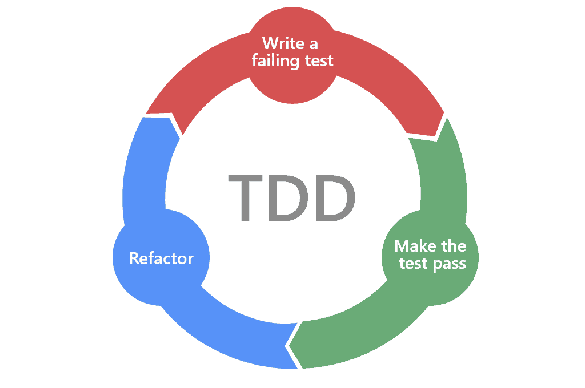
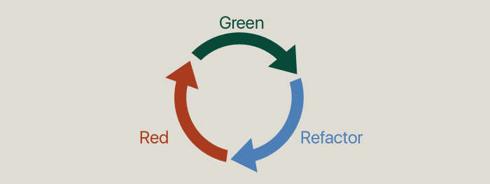
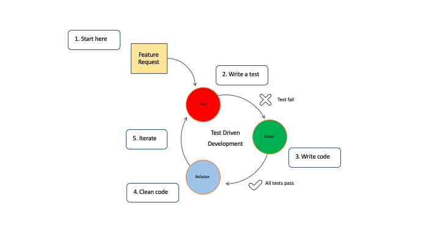

<!-- TOC -->
<!-- TOC -->

# Test Driven Development

---

## Glossar:

| Abkürzung | Erklärung               |
|-----------|-------------------------|
| TDD       | Test Driven Development |

## Lernziel:

* Ich kenne die Grundlagen von TDD

---

## Einführung

Test Driven Development, kurz TDD, ist keine neue Idee, sondern existiert etwa seit 2003. TDD ist ein wichtiger Aspekt
von [Agile
Programming](https://en.wikipedia.org/wiki/Agile_software_development).

Ron Jeffries (einem Coach von [Extreme Programming](https://en.wikipedia.org/wiki/Extreme_programming)) verspricht
einem "Clean code that works", sofern man TDD regelmässig trainiert und es konsequent und gründlich anwendet. Extreme
Programming ist eine Art Code zu schreiben, welche dem Agile Manifest folgt. Aus diesem Grund, kann es Sinn machen, TDD
anzuwenden, falls man sich in einem Agilen Team bewegt. 
Allerdings kann es sich als schwierig entpuppen, TDD anzuwenden, sofern man bei einem Projekt dies nicht von Anfang an
gemacht hat. Vielfach ist es halt so, dass wir Projekte, welche nicht mit TDD getrieben worden sind, erweitern müssen.

## Was ist TDD

TDD heisst, dass wir Tests benutzen, welche das Schreiben unseres Codes antreiben.  
Es gibt einen Workflow, der TDD benutzt welchen man als Red, Green und Refactor bezeichnet.

* **Red**: Wir schreiben Tests für die Business Logik, welche wir initial erwarten zu failen
    * Sie werden failen, da wir bis dahin, keinen Code geschrieben haben, welche den Test erfolgreich machen könnte
* **Green**: Wir schreiben Code, oder korrigieren Code, sodass unsere Tests erfolgreich sind
* **Refactor**: Ab dem Zeitpunkt wo unsere Tests erfolgreich sind, können wir unseren Code sowie Tests refactoren, um
  sie
  effizienter zu machen
* Es ist ein iterativer Prozess, sprich, er wiederholt sich immer wieder vom ersten Schritt (Red)

TDD Mantra: Wir schreiben zuerst einen Test welcher failt, bevor wir eine einzelne Zeile 'richtigen' Code schreiben.
**Jeder Test sollte nur eine einzige** identifizierbare Logik oder Verhalten überprüfen. Sofern reden wir hier von Unit
Tests.

### Iteratives Verhalten

Wichtig zu verstehen ist, dass es ein iteratives Verhalten sein wird. Wird müssen viele verschiedene Tests schreiben /
refactoren, bis wir eine Funktionalität komplett implementiert haben.

* Jeder Test sollte eine einzelne Logik testen
* Jeder Test sollte ein Szenario dieser Logik testen
* Demnach, existieren, mehrere Tests für eine einzelne Logik

---

### Best Practices für Test Driven Development

TDD ist eine Praxis der Softwareentwicklung, die das Schreiben von Tests vor dem Schreiben des eigentlichen Codes in den
Vordergrund stellt. Sie folgt einem zyklischen Prozess, bei dem ein fehlgeschlagener Test geschrieben wird, der minimale
Code geschrieben wird, um den Test bestehen zu lassen, und dann der Code überarbeitet wird. Hier sind einige bewährte
Verfahren, die bei der Anwendung von TDD zu beachten sind:

1. Beginnen Sie mit einem klaren Verständnis der Anforderungen: Beginnen Sie damit, die Anforderungen oder
   Spezifikationen der Funktion, die Sie entwickeln, zu verstehen. Dies wird Ihnen helfen, gezielte und relevante Tests
   zu schreiben.
2. Schreiben Sie atomare Tests: Jeder Test sollte sich auf ein bestimmtes Verhalten oder eine bestimmte Funktionalität
   konzentrieren. Halten Sie Ihre Tests klein und konzentriert, indem Sie einen einzigen Aspekt des Codes behandeln.
   Dies verbessert die Lesbarkeit der Tests, die Wartbarkeit und erleichtert die Fehlersuche.
3. Schreiben Sie zuerst den einfachsten Testfall: Beginnen Sie damit, den einfachsten Testfall zu schreiben, der
   fehlschlagen wird. So können Sie sich auf die unmittelbare Aufgabe konzentrieren und vermeiden, dass Sie sich im
   Vorfeld mit komplexen Szenarien überfordern.
4. Schreiben Sie Tests für Randfälle: Berücksichtigen Sie beim Entwurf Ihrer Tests Randbedingungen und Randfälle. Dabei
   handelt es sich um Eingaben oder Szenarien, die am äussersten Rand des Eingabebereichs liegen und häufig potenzielle
   Fehler oder unerwartetes Verhalten aufzeigen.
5. Refactoren Sie regelmässig: Nachdem ein Test bestanden wurde, sollten Sie sich die Zeit nehmen, den Code zu
   refactoren und das Design zu verbessern, ohne das Verhalten zu ändern. Dies trägt dazu bei, einen sauberen und
   wartbaren Code zu erhalten, während das Projekt fortschreitet.
6. Behalten Sie eine schnelle Feedbackschleife bei: Ihre Testsuite sollte schnell ausgeführt werden, damit Sie
   sofortiges Feedback über den Zustand Ihres Codes erhalten. Schnelles Feedback ermöglicht schnellere
   Entwicklungsiterationen und fängt Probleme frühzeitig auf.
7. Automatisieren Sie Ihre Tests: Nutzen Sie Frameworks und Tools zur Testautomatisierung, um die Ausführung Ihrer Tests
   zu automatisieren. Auf diese Weise können Sie Tests häufig ausführen, sie einfach in Ihren Entwicklungsworkflow
   integrieren und konsistente und zuverlässige Testergebnisse sicherstellen.
8. Befolgen Sie den Red-Green-Refactor-Zyklus: Halten Sie sich an den TDD-Zyklus: Schreiben Sie einen fehlgeschlagenen
   Test (Red), implementieren Sie den Mindestcode, um den Test zu bestehen (Green), und überarbeiten Sie dann den Code,
   um sein Design zu verbessern (Refactor). Wiederholen Sie diesen Zyklus für jedes neue Verhalten oder jede neue
   Funktion.
9. Kontinuierliche Ausführung von Tests: Integrieren Sie Ihre Testsuite in Ihre Entwicklungsumgebung und richten Sie
   Pipelines für die kontinuierliche Integration (CI) ein, um Tests automatisch auszuführen, sobald Codeänderungen
   vorgenommen werden. Dies stellt sicher, dass die Tests konsistent ausgeführt werden und hilft, Regressionen
   frühzeitig zu erkennen.

---

### Vorteile von TDD

TDD ermutigt zum Schreiben von testbarem, lose gekoppeltem Code, der tendenziell modularer ist. Da gut strukturierter,
modularer Code einfacher zu debuggen, zu verstehen, zu pflegen und wiederzuverwenden ist, hilft TDD:

* Kosten zu reduzieren
* Refactoring und Rewriting einfacher und schneller zu machen
* Onboarding von neuen Leuten auf dem Projekt einfacher zu machen
* Bugs und Kopplung zu verhindern
* Verbesserung der allgemeinen Teamzusammenarbeit
* Erhöhung des Vertrauens, dass der Code wie erwartet funktioniert
* Verbesserung der Coding Patterns
* Beseitigung der Angst vor Veränderungen

TDD ermutigt auch zur ständigen Reflexion und Verbesserung. Dadurch werden oft Bereiche und Abstraktionen in Ihrem Code
aufgedeckt, die überdacht werden müssen, was dazu beiträgt, das Gesamtdesign voranzutreiben und zu verbessern.

Schliesslich können die Entwickler durch eine umfangreiche Testsuite, die fast alle möglichen Pfade abdeckt, während der
Entwicklung schnelles Feedback in Echtzeit erhalten. Dies reduziert den Gesamtstress, verbessert die Effizienz und
erhöht die Produktivität.

---

## Source

* https://en.wikipedia.org/wiki/Test-driven_development
* https://testdriven.io/test-driven-development/
* https://www.ibm.com/garage/method/practices/code/practice_test_driven_development/

# Checkpoint

* Ich weiss, wie man TDD anwenden kann
* Ich kenne den Workflow von TDD mit allen Phasen
* Ich weiss, wieso es ein iterativer Vorgang ist
* Ich kenne die Best Practices von TDD
* Ich kenne die Vorteile von TDD

