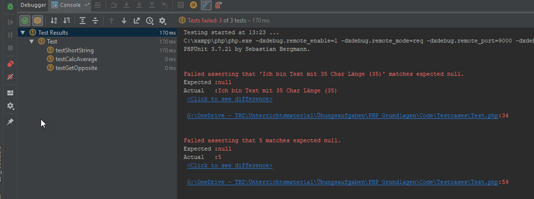

# Aufgaben

* Lösen Sie die Aufgaben zu zweit in der Gruppe
* Stellen Sie sicher, dass Ihre Lösungen in Ihrem Repository abgelegt sind

## Zielsetzung
Ziel dieser Übungsaufgabe ist es Ihnen aufzuzeigen, dass eine komplette Programmlogik mit Unit-Tests beschrieben werden kann - also alle Anforderungen an eine Applikation verfasst als Testcases. Test driven development tut genau das: Die zuvor definierten Unit-Tests beschreiben die Anforderungen an die Applikation, die es im Anschluss genau nach den Anforderungen zu implementieren gilt, bis alle Testcases grün sind (d. h. erfolgreich bestanden werden).

In der Übungsaufgabe werden Ihnen nur die Testcases und die Grundstruktur der Klasse zur Verfügung gestellt. Ziel ist es, dass Sie alle Methoden der Klasse so implementieren, dass am Schluss alle Tests bestanden werden.

---

## Aufgabe 1 - Setup environment
Um die Übung erfolgreich meistern zu können, müssen Sie PHPUnit in Ihrer IDE oder auf Ihrem Entwicklungsserver installieren. Anleitungen dazu finden Sie im Internet. Viele IDE's unterstützen PHPUnit bereits in der Standard-Installation - insbesondere die IDE's, die auf die PHP-Entwicklung spezialisiert sind wie beispielsweise PHPStorm, welche Sie als Lernende kostenlos beziehen und nutzen können (https://www.jetbrains.com/community/education/#students - oder als 30-Tage-Trial https://www.jetbrains.com/phpstorm/download). Bei anderen IDE’s gibt es PlugIns, die das Arbeiten mit PHPUnit erleichtern. Suchen Sie die zu Ihrer IDE passende Anleitung für PHPUnit.

Wenn Sie ganz ohne IDE-Unterstützung mit PHPUnit arbeiten wollen, finden Sie eine gute Anleitung unter https://grobmeier.solutions/de/testen-mit-phpunitphp-f%C3%BCr-anf%C3%A4nger.html.

---

## Aufgabe 2 - Methoden implementieren
Für die Aufgaben benötigen Sie [FancyApp.zip](./x_gitres/FancyApp.zip). Laden Sie das ZIP-File herunter und entpacken Sie es. Darin finden Sie einen Ordner **Testcases** mit der Datei **Test.php**. Diese Datei enthält die Unittests, die beschreiben, wie die Methoden der Klasse **MyFancyClass** funktionieren sollen.

Im Ordner **Application** finden Sie die Datei **MyFancyClass.php**. Darin finden Sie die Klassendefinition von **MyFancyClass** inkl. der drei Methoden, die durch die Unittests geprüft werden. Der Methoden-Body ist aber bei allen Methoden abhandengekommen. Dadurch sind auch alle Unittests Rot (nicht erfolgreich), wenn Sie diese ausführen.

### Empfohlenes Vorgehen
1. Entpacken Sie das ZIP-Archiv und öffnen Sie den darin enthaltenen Ordner in der IDE Ihrer Wahl. 
2. Recherchieren Sie, wie Sie die Unittests ausführen müssen und führen Sie diese ohne Anpassungen am Code aus. Die Unittests sollten alle fehlschlagen. Sie sollten ungefähr folgende Inhalte sehen (abhängig von der eingesetzten IDE und den Versionen kann es aber anders aussehen):

3. Öffnen Sie Test.php und versuchen Sie nachzuvollziehen, was die einzelnen Testmethoden tun. Die Methoden der Klasse Test die im Namen mit test starten (z. B. testShortString() ) sind die Testfälle. Die Methoden die mit assert starten (z. B. assertEquals() ) sind die Bedingungen, die alle erfüllt sein müssen, damit der Testfall als bestanden gilt. 
4. Öffnen Sie nun MyFancyClass.php. Beginnen Sie die Methoden so zu schreiben, dass alle Bedingungen (Assertions) erfüllt werden. Ist das geschafft, dann sollten Sie am Ende eine Applikation in den Händen halten, die genau das tut, was die Tests von ihr verlangen bzw. erwarten. Alle Tests sollten erfolgreich durchgeführt werden (grün werden).

---

## Aufgabe 3 - Auswerten
Vergleichen Sie nun Ihre Lösung mit den Lösungen der anderen Gruppen. Verwenden Sie ein Text-Compare-Tool, um Ihren Code mit den Codes der anderen Gruppen zu vergleichen. Haben Sie die Anwendung gleich implementiert? Tun die Anwendungen dasselbe oder gibt es Abweichungen in der Funktionalität? Sind die Abweichungen gross oder handelt es sich um vernachlässigbare Unterschiede?

---
